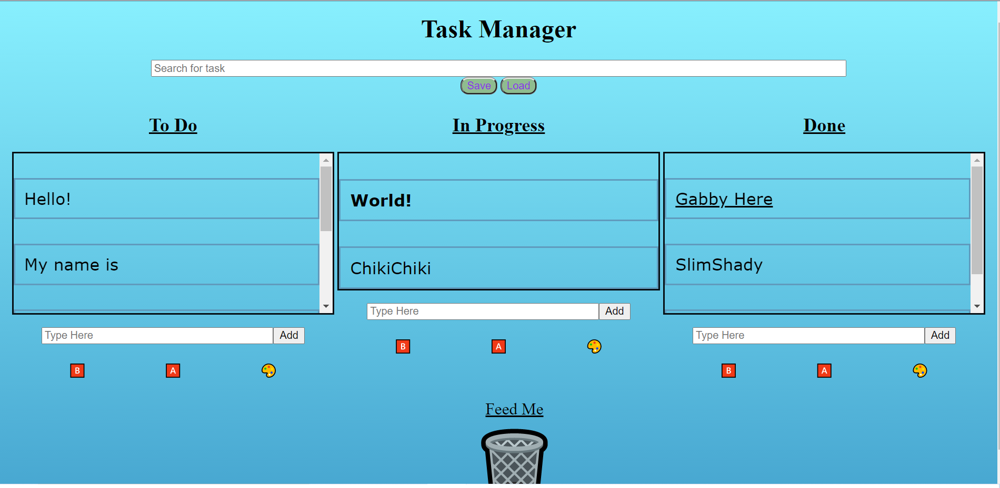

# Cyber4s 3rd Pre-Course Final Project

## Gabby's KanBan board:

#### Link to project: https://gabbymill.github.io/kanban-final/solution/

### Overview

This is a kanban board in which you can store your tasks and keep track of their progress!
The data will save locally on your browser and if you choose you can save and load from an api.

The app has many features such as:

##### searching for specific cards,

##### moving them around with alt + 1-3,

##### dragging them around with your mouse,

##### putting in bold or underlined text,

##### changing the color of the boxes,

##### deleting old useless cards.

###### All changes made during use of the app are always updated, don't be afraid to close your browser.

This app uses iro.js for UI of color palette.
Other than that it is completely Vanilla JS.
