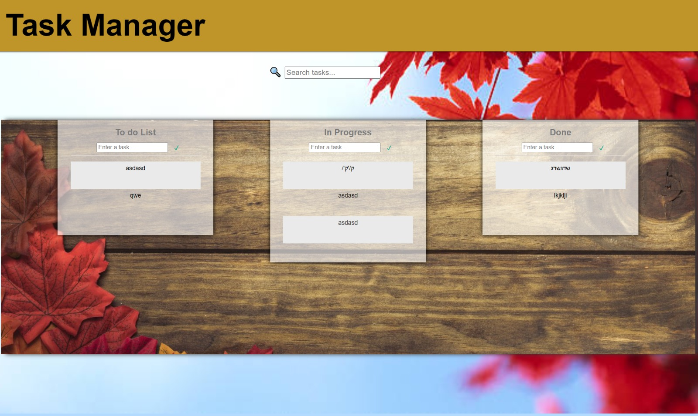

## Intrudaction to task manager web
hey this is my to do app  
you can see it live right here :https://romans1995.github.io/kanban-final/solution/   
here you can write down what you need to or what are you doing right now or what you've done alrady :D  
here how its looks like

<h2>so what can you do ?</h2>
<ul>
<li>add new tasks</li>
<li>you can edit your tasks by double clicking on it</li>
<li>you can serach for spesific task </li>
<li>move task if you hove with your mouse on an task and then press ALT + 1,2 or 3 <br?> after that the task will move to   1 : do list.  2 : in progress list and 3 : done list</li>
<li>you can drag and drop tasks with your mouse </li>
</ul>
