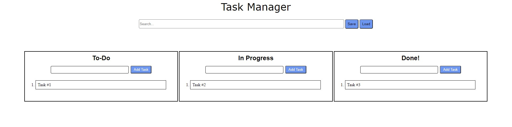

# Daniel's Kanban! - Task Manager

## GUI Kanban

Welcome to my Kanban project! Here is a sneak peek 😯



## Project's Description

### What is kanban?

Kanban is a program that help you organize your tasks, managing them and improving services that deliver knowledge work. 

### Whats the goal of this project?

My Kanban's goal is to visualize work tasks and giving maximum efficiency workflow to the team or individual.

## Kanban's Interactions

 - [x] _Search bar_ – Can search through tasks, case-insensitive. Start searching by every key pressed down. 

    **NOTE!** Every change in the page will always display tasks according to search input. For example, search input would contain "t", if you will add a task that does not include "t", the task will not be displayed (Will be added but not displayed)  

 - [x] _Add task_ – Every section as an input with an "Add task" button. To add task, insert your task in the right input and press on "Add task". **NOTE!** Empty task is not allowed.

 - [x] _Edit task_ – To edit a task, Double Click on the task, change the text inside and then press anywhere else on the screen, this would save the task. **NOTE!** Empty task is not allowed.

 - [x] _Drag and drop tasks_ – To change the location of a task, drag the task to the wanted section and drop where the color turns blue. Also you cant change the place of the task inside the section the same way.

 - [x] _Move task with key combo_ – To change task's section, do `Alt + number`. Move a task to "To-do" press `Alt+1`, Move task to "In-progress" press `Alt+2` and Move task to "Done" press `Alt+3`. The Moved task will always be displayed at the top of the section.

 - [x] _Delete task_ – To delete a task, right click on the task and choose "Delete task", confirm the delete at the top of the page, and the task will be deleted. Another way to delete a task is to press ` ← backspace` on a selected task. After confirmation, the task will be deleted. 

 - [x] _Save button_ – The save button will save the current tasks on a server which allows to load the information from any other computer.

 - [x] _Load button_ – The load button will load the tasks that have been saved on the server. Unsaved task will be automatically deleted from local storage and will be replaced with the loaded tasks. 

## Data storage

Data is saved on local storage any time you add, edit, remove or load tasks, in this format:
```
{
  "todo": [],
  "in-progress": [],
  "done": []
}
```

 ## Code Languages

 - **JavaScript**
 - **HTML**

 ## Future Updates

 - [ ] Important task - Mark important task on page.
 - [ ] Picture adding - Add picture to tasks

 ## Details

 - Github [Profile](https://github.com/DanielPhilosoph "My Github")
 - Email: danielph9@gmail.com 


